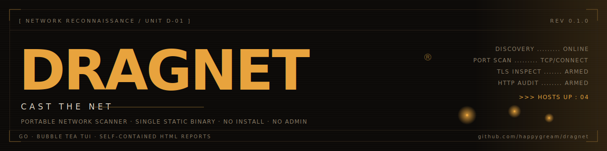
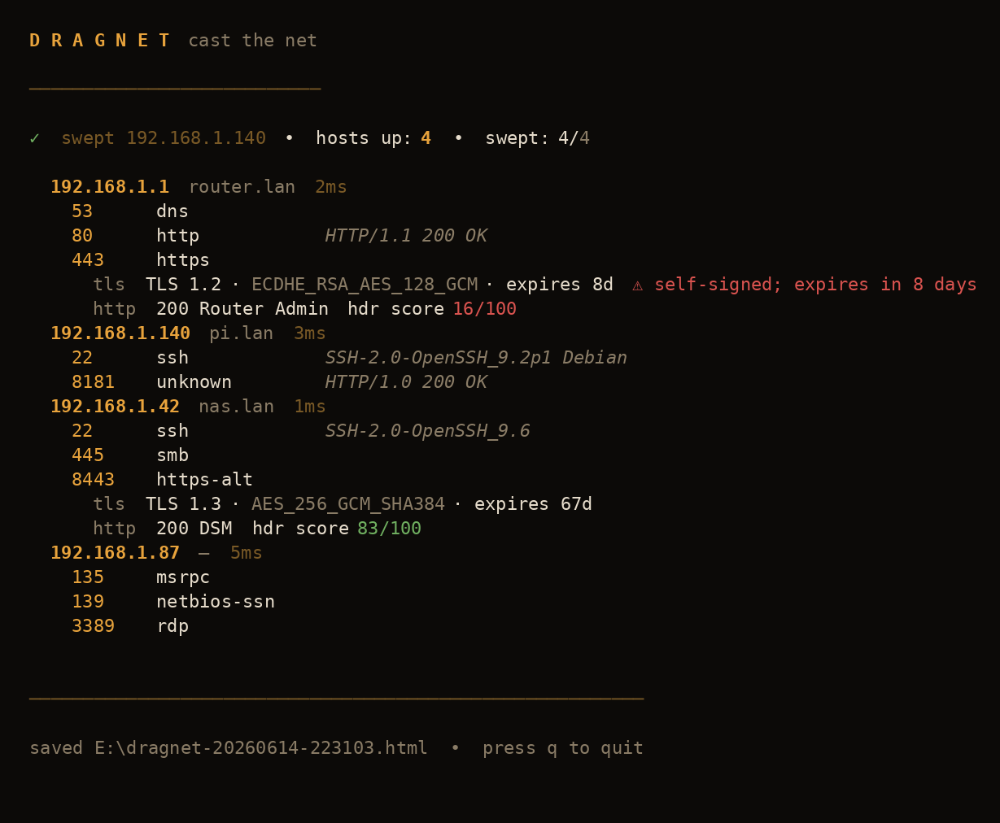
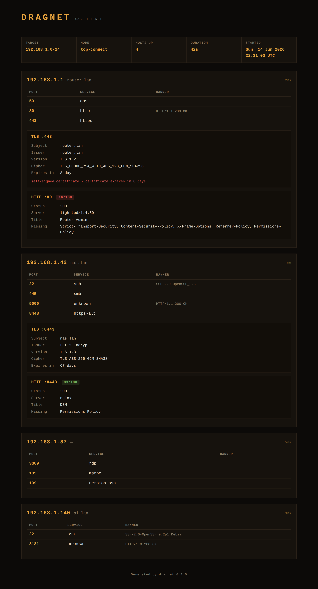

<p align="center">
  
</p>

<p align="center">
  <code>cast the net</code> — a portable network scanner that runs straight off a USB stick.<br>
  Single static binary. No install, no admin, no dependencies.
</p>

<p align="center">
  
  
  
</p>

---

dragnet casts a net across a network and hauls in whatever's listening. Point it at a
subnet or a single host and it sweeps for live machines, scans ports, grabs banners,
inspects TLS certificates, and grades HTTP security headers — then writes the whole
catch to a self-contained report. One binary you can run from a USB stick on any
Windows machine, with no install and no administrator rights.

## What it does

- **Host discovery** — sweeps a CIDR or single IP and surfaces live hosts as they
  answer, with reverse-DNS and round-trip time.
- **Port scan** — concurrent TCP-connect scan. Curated top ports by default, or any
  range or explicit list you ask for.
- **Service + banner** — labels known ports and grabs the greeting banner where one
  is offered.
- **TLS inspection** — handshakes TLS ports and reports subject, issuer, version,
  cipher, expiry, plus self-signed and weak-protocol warnings.
- **HTTP audit** — grades security headers (HSTS, CSP, X-Frame-Options and more) and
  scores each web port out of 100.
- **Reports** — every run writes a timestamped `dragnet-*.json` and a self-contained,
  styled `dragnet-*.html` you can open in any browser.

## Interface

<p align="center">
  
</p>

A live amber/noir terminal UI built on Bubble Tea. Hosts surface into the table as
they are caught; ports, TLS findings and header scores fill in beneath each one.
Warnings (expired or self-signed certs, weak TLS) flag in red, passing header scores
in green.

When the scan finishes, the same data is written to a standalone HTML report:

<p align="center">
  
</p>

## Usage

```
dragnet -target 192.168.1.0/24
dragnet -target 10.0.0.5 -ports all
dragnet -target 192.168.1.0/24 -ports 1-1024 -out E:\reports
dragnet -target 10.0.0.5 -ports 22,80,443 -no-tui
```

| flag | default | meaning |
|------|---------|---------|
| `-target` | *(required)* | CIDR or IP, e.g. `192.168.1.0/24` |
| `-ports` | `top` | `top`, `all`, a range `1-1024`, or a list `22,80,443` |
| `-concurrency` | `512` | max concurrent probes |
| `-timeout` | `800ms` | per-probe timeout |
| `-out` | `.` | directory for saved reports (point it at your USB) |
| `-no-tui` | `false` | plain log output instead of the TUI |
| `-version` | | print version and exit |

In the TUI: `q`, `esc`, or `ctrl+c` to quit.

Drop the binary on the stick and point `-out` at the drive (e.g. `-out E:\`) so
reports land on the USB, not the host you plugged into.

## Install

Grab a prebuilt binary from the [releases page](https://github.com/happygream/dragnet/releases),
or build from source with Go 1.23+:

```
go install github.com/happygream/dragnet/cmd/dragnet@latest
```

Or clone and build a portable Windows exe:

```
git clone https://github.com/happygream/dragnet
cd dragnet
make windows          # -> dragnet.exe (stripped, ~6.6 MB)
```

`make` targets: `windows`, `linux`, `build` (host), `run`, `vet`, `tidy`, `clean`.

## Privilege model

dragnet ships **TCP-connect** mode, which works everywhere with no admin and no
driver. This is the portable default and the right choice when plugging into a
machine you don't control.

**SYN mode** is wired through the data model but intentionally not enabled. A raw SYN
scan on Windows needs [Npcap](https://npcap.com) installed (an admin install, which
breaks the no-install goal) plus an elevated process. `detectMode()` in
`cmd/dragnet/mode.go` already checks for elevation per-OS and switches to `ModeSYN`
once `hasRawCapture()` returns true. To add it: pull in `gopacket`, implement
`hasRawCapture()` behind a `pcap` build tag, and add the SYN sender/receiver in
`internal/scan`. Until then everything runs portably in connect mode.

## Layout

```
cmd/dragnet/        CLI: flags, privilege detection, report writing
internal/model/     shared types (Host, PortState, TLSInfo, HTTPInfo, Report)
internal/discover/  CIDR expansion + liveness sweep
internal/scan/      port scan, banner grab, TLS, HTTP audit, orchestrator
internal/tui/       Bubble Tea amber/noir interface
internal/report/    JSON + self-contained HTML writers
```

## A note on responsible use

Connect scans are detectable and will appear in target logs. Scan only networks you
own or are explicitly authorised to test. Saved reports map a network's surface —
treat them as sensitive.

## License

MIT. See [LICENSE](LICENSE).
